<div align="center">
  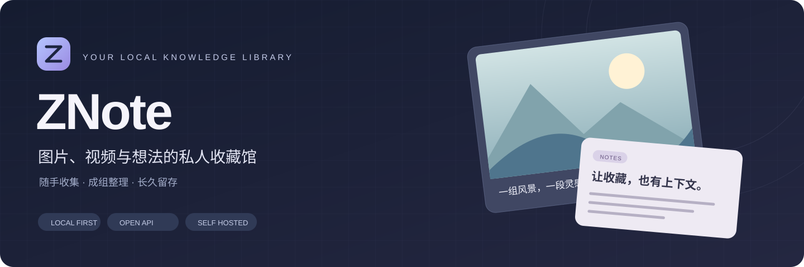
  <h1>ZNote</h1>
  <p><strong>把喜欢的图片、值得回看的视频、随手记下的想法，放进自己的知识库。</strong></p>
  <p>图片素材库 · Markdown 图文笔记 · 浏览器采集 · 微信收件 · 本地自托管</p>
  <p>
    
    <a href="LICENSE"></a>
    
    
    
  </p>
  <p>
    <a href="#先看一眼">界面展示</a> ·
    <a href="#微信收件箱">微信收件</a> ·
    <a href="#浏览器采集">浏览器采集</a> ·
    <a href="#快速开始">快速开始</a> ·
    <a href="docs/USAGE.md">使用指南</a> ·
    <a href="docs/API.md">开放 API</a>
  </p>
</div>

## 先看一眼

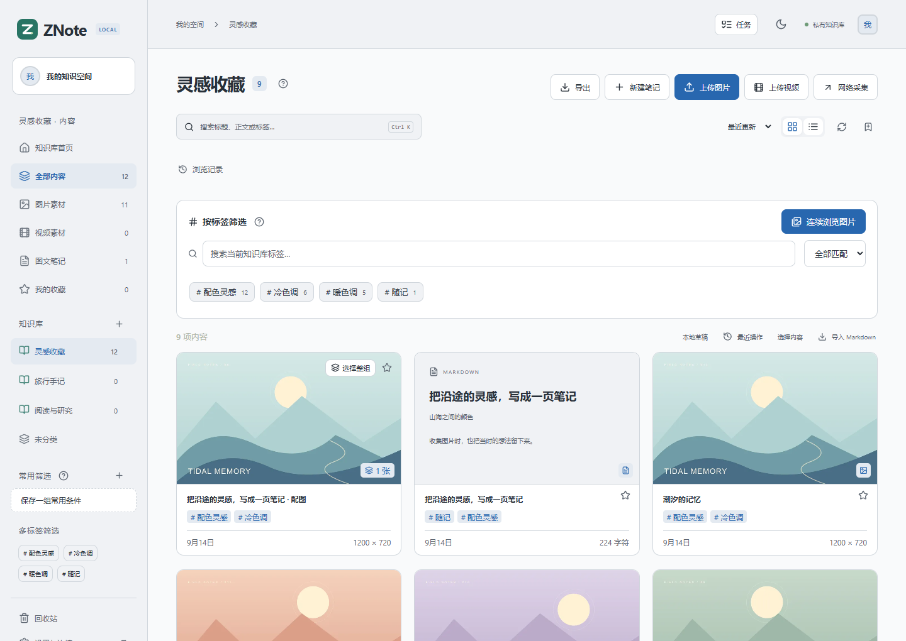

<p align="center"><sub>当前版本的真实界面 · 独立演示库中的原创示例素材 · 点击图片可查看大图</sub></p>

ZNote 面向以图片为主的个人资料整理。**一张图片可以是素材，一组图片可以是画册，配上文字又可以成为笔记。** 所有设备访问同一个服务，原文件和数据库保存在自己的电脑或 NAS 上。

| 收集 | 整理 | 留存 |
| :--- | :--- | :--- |
| 拖拽、粘贴、批量上传 | 知识库与标签分别管理 | 原文件按字节保留、相同内容去重 |
| 浏览器悬停入库、正文提取 | 图片成组、拖动排序、首图封面 | Markdown、离线网页等六种导出 |
| 微信随手发送文字与图片 | 多标签筛选、批量操作、常用筛选 | 轻量恢复快照、迁移导出、API 接入 |

### 适合放进哪些内容

| 你的场景 | 在 ZNote 中怎样使用 |
| :--- | :--- |
| 设计、插画与摄影参考 | 按项目建库，用作者、配色、构图等多个标签筛选，连续浏览参考图 |
| 漫画、作品集与系列图 | 批量采集后按作品成组，调整页序与封面，记住上次看到的位置 |
| 阅读与资料研究 | 保存网页正文和配图，保留 Markdown 链接，再补充自己的笔记 |
| 日常灵感与旅行记录 | 在微信分开发文字、照片和说明，按天汇成一篇图文笔记 |
| 视频片段与收藏 | 本地保存、首帧封面、预览播放，并在其他设备上继续观看 |

## 微信收件箱

**像给自己发消息一样，把灵感送回知识库。** 电脑前可以直接写笔记，出门时也可以在个人微信的收集会话里发送文字和图片。

<table>
  <tr>
    <td width="43%" align="center"><strong>手机端 · 随手发送</strong></td>
    <td width="57%" align="center"><strong>ZNote · 按天收进笔记</strong></td>
  </tr>
  <tr>
    <td align="center">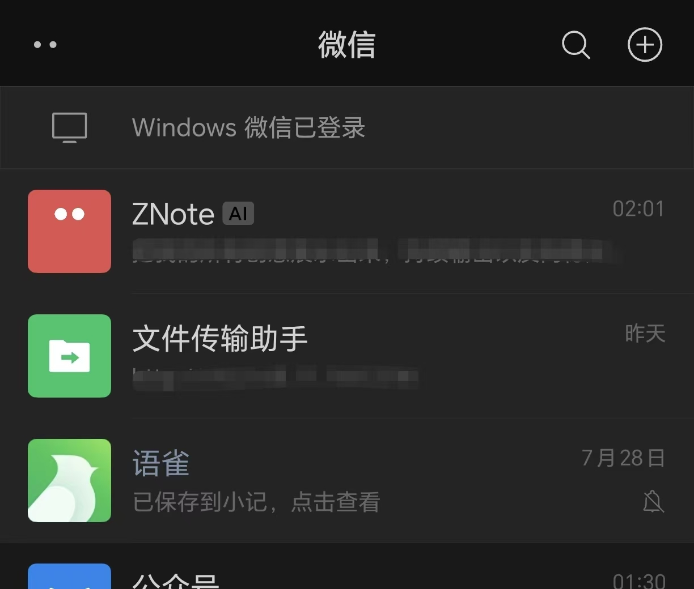</td>
    <td align="center">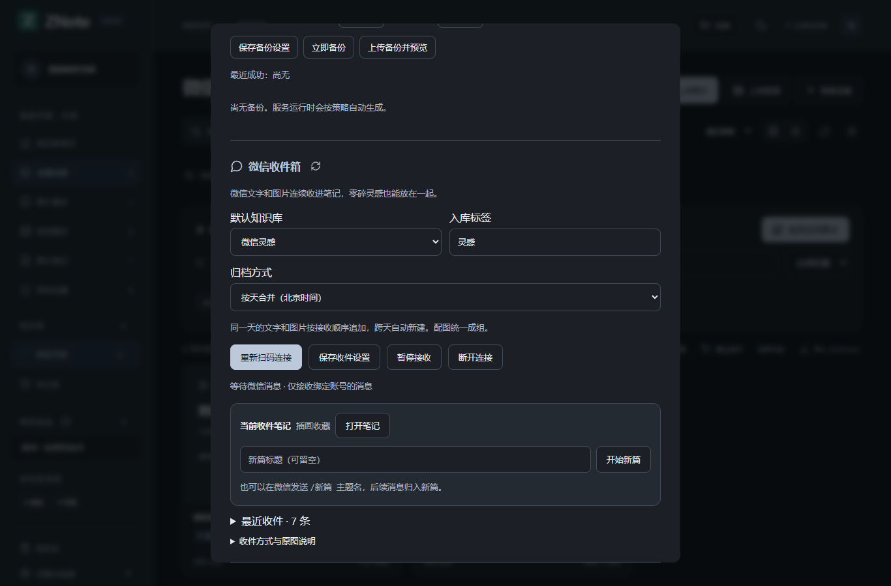</td>
  </tr>
</table>

<sub>左图为用户提供的实际微信入口截图，消息摘要已打码；右图为演示库的收件设置。入口名称和显示方式以实际绑定为准。</sub>

默认 **按天合并（北京时间）**：先发一段文字，再发几张图片，最后补充说明，这些内容会按接收顺序追加到同一篇「微信收件 · YYYY-MM-DD」，配图也会自动成组。

每条消息在笔记预览中独立成块，保留换行、连续空行和 Markdown 链接。可直接编辑单条消息、拖动把手排序，或复制、剪切、删除；手机也可通过上下按钮调整顺序。修改进入本地草稿，点击 **保存** 后同步到知识库，误操作可撤销，已保存内容可从版本记录恢复。删除消息中的图片引用不会删除素材原文件。

旧版笔记按已有分隔线识别内容块；新版微信收件记录独立边界，消息自身的 Markdown 分隔线不会把一条消息拆散。正文仍是可导出的 Markdown。

```text
你在微信发送                         ZNote 自动归档

09:20  今天看到的建筑参考 ─┐
09:21  [图片] [图片]      ├────→  微信收件 · 当天日期
09:23  喜欢这个立面的配色 ─┘        文字 + 本地配图 + 补充说明

14:00  /新篇 旅行计划     ─────→  后续内容进入「旅行计划」
```

1. 打开 **「设置与连接 → 微信收件箱」**，选择默认知识库和标签。
2. 点击 **「扫码连接微信」**，由本人使用个人微信扫码确认。
3. 向绑定的 **ClawBot 收集会话**发送文字、图片，在「最近收件」查看结果。

一天内换话题，可以发送 **`/新篇 主题名`**，或在设置里点击「开始新篇」。也可选择跨天持续追加的「手动分篇」，以及原来的「每条单独保存」。已有笔记的标题、正文与封面顺序会保留；旧笔记不会自动合并。

**手机与 ZNote 无需同一局域网。** 双方能够连接互联网即可，运行中的 ZNote 主动从微信服务器收取消息，无需公网 IP、端口映射或内网穿透。ZNote 主机需要保持开机、不休眠、联网并开启接收，知识库网页可以关闭。

<details>
<summary>账号要求、支持范围与异常处理</summary>

- 需要微信账号和客户端可使用 ClawBot 通道；由本人扫码确认，实际可用性以绑定结果为准。
- 无需安装 OpenClaw 或配置 AI 模型；只接收绑定账号发往此入口的消息，不读取普通好友聊天或历史记录。
- 当前接收文字与图片，不接收群聊、语音、视频及其他文件。微信可能压缩发送的图片，ZNote 保留实际收到的文件。
- 同篇有消息失败时，后续消息等待；重试或忽略后继续，避免图片与说明错序。连接过期时需重新扫码；停机期间能否补收取决于微信平台保留情况。
- 单篇最多 50 万字符、30 个标签。设置变化只影响后续收件，排队消息保留原归档目标。
- 微信投递只负责收集；在外直接访问知识库网页，仍需另行配置远程访问。

</details>

[微信接入与迁移说明 →](addons/connectors/weixin/README.md)

## 图文笔记，让图片有上下文

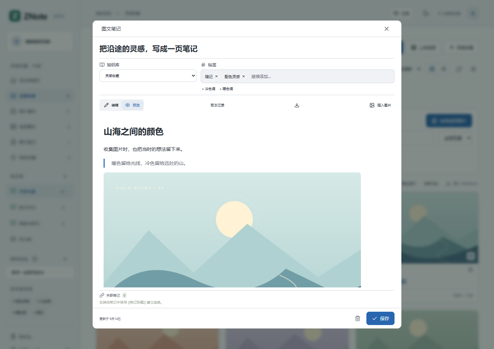

收集图片时，顺手记下「为什么保存它」。笔记支持 **Markdown、链接、引用、任务列表和 `[[双向链接]]`**；图片说明同样支持 Markdown。正文中的配图本地保存，点击任意图片即可连续浏览，同篇配图在素材库中折叠为一组。

- **写到一半也能回来**：本地草稿保留正文、光标和编辑位置，`Ctrl / ⌘ S` 提交到知识库。
- **修改可以回看**：保留最近的笔记版本，旧版本先载入编辑器，确认保存后再更新。
- **网页图片尽量归档**：保存时尝试将外链图片转为本地附件；无法下载的图片保留来源和失败说明。

本地草稿属于当前浏览器，不跨设备同步；已提交的笔记才由所有设备共享。[草稿、版本与配图详情 →](docs/USAGE.md#安心续写)

## 成组浏览与整理

| 连续浏览 · 保留整组上下文 | 拖动排序 · 第一张就是封面 |
| :---: | :---: |
| 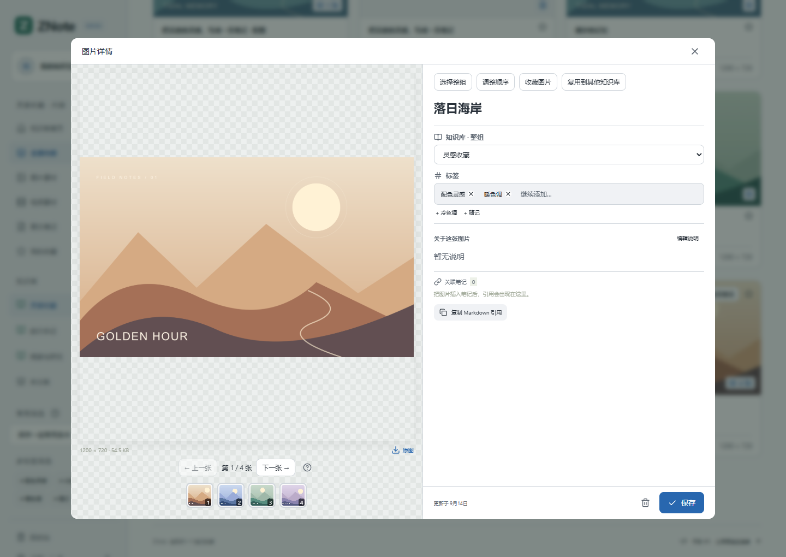 | 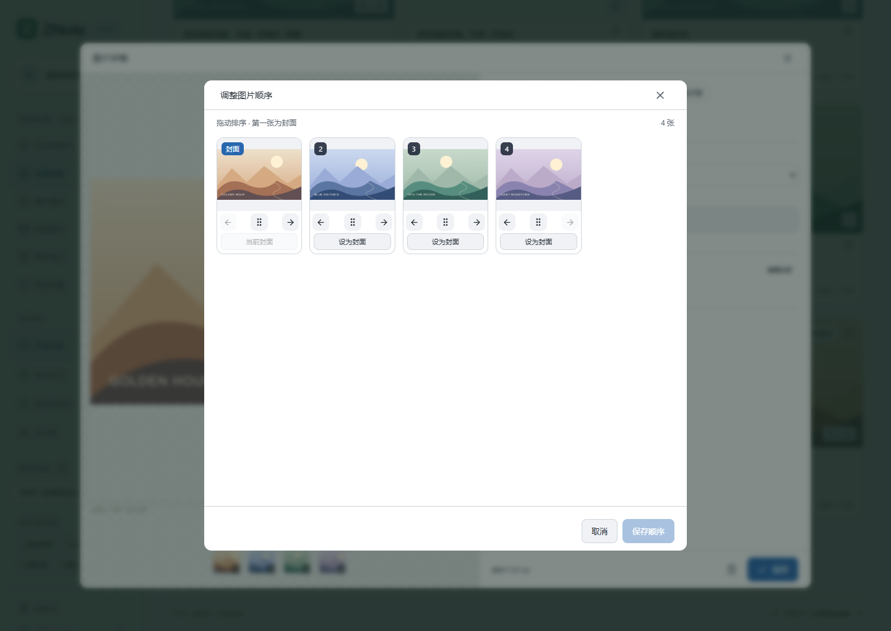 |

一部漫画、一套作品、一篇笔记的配图，都可以作为一组管理。打开后用底部缩略图定位；桌面按 **A / D、← / →** 或滚轮翻页，点击展开后滚轮改为缩放。手机支持左右滑动、双指缩放与拖动平移。

拖动缩略图调整页序，第一张自动成为封面。整组移动到其他知识库时，笔记配图会连同所属笔记一起移动。浏览记录按知识库保存，在其他设备登录同一服务后可继续查看。

## 连续批量整理

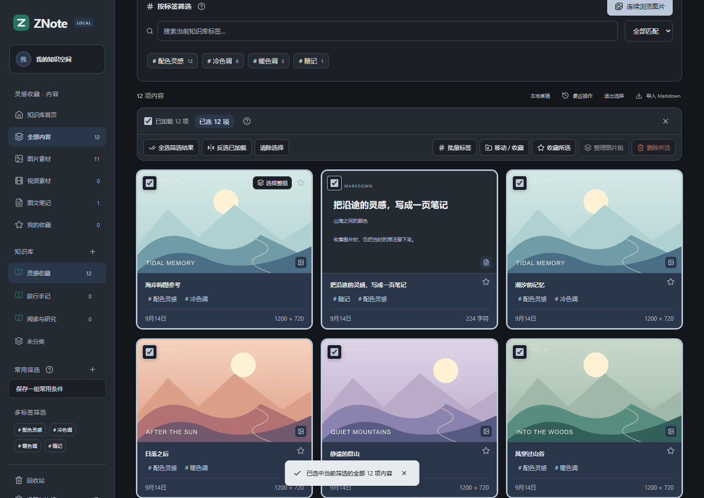

**先筛选，再整批处理。** 选择一个或多个标签，切换「全部匹配 / 任意匹配」，也能将常用条件保存下来。全部内容、图片、视频、笔记、收藏与标签都以当前知识库为范围。

| 想做什么 | 顺手的操作 |
| :--- | :--- |
| 选中内容 | 点击「选择内容」，或 `Ctrl / ⌘ + 点击卡片`；点击卡片正文也能勾选 |
| 选中一段 / 全部 | `Shift + 点击` 连选；`Ctrl / ⌘ A` 选择筛选结果，包含未加载的内容 |
| 选中整套作品 | 点击「选择整组」，一次覆盖所有页，再按需要取消个别图片 |
| 批量归类 | 添加标签、移动、收藏、合并 / 拆分图片组，操作后可以继续整理 |
| 找回误操作 | 支持的操作可在提示或「最近操作」中撤销；删除先进入当前库回收站 |

批量工具栏滚动时保持可见，全选支持进度和取消。永久删除不可撤销；回收站配图引用与原文件释放规则见 [完整操作指南](docs/USAGE.md#连续批量整理)。

## 浏览器采集

桌面 **Chrome / Edge** 扩展将采集入口放在浏览中的页面上。悬停看大图，点击按钮或按快捷键保存；系列作品就地批量入库，减少切换页面与反复整理。

<table>
  <tr>
    <td width="40%" align="center">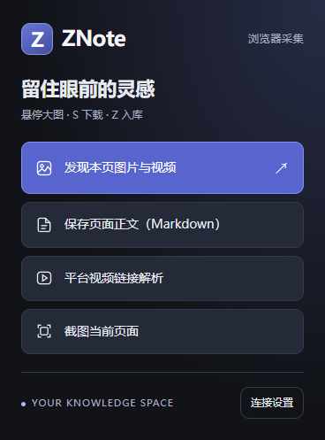</td>
    <td>
      <strong>图片：悬停 → 预览 → 入库</strong><br />
      默认 S 下载、Z 保存知识库，按键和预览大小可自定义。<br /><br />
      <strong>视频：嗅探 → 选择 → 保存</strong><br />
      专门嗅探 MP4、WebM、MOV 和 m3u8，列出资源供预览、下载或入库。<br /><br />
      <strong>正文：保留文字，也带走配图</strong><br />
      转为 Markdown 图文笔记，保留链接，并尝试将配图本地归档。
    </td>
  </tr>
</table>

### 接通之后，就地收藏

1. 在 ZNote「设置与连接」下载扩展 ZIP，解压到固定目录。
2. 在浏览器扩展管理页开启开发者模式，选择「加载解压缩的扩展」。
3. 同一浏览器刷新 ZNote，点击 **「一键连接扩展」**，选择默认知识库和标签。

正常更新时覆盖原目录、重新加载扩展并刷新网页，连接与偏好保留。点击扩展图标可一键禁用或恢复当前网站的预览与视频嗅探；黑名单也可在设置中批量管理，当前连接的 ZNote 自动排除。

### 从单张图片，到整部作品

| 内容来源 | 与知识库的配合 |
| :--- | :--- |
| 普通网页图集、Paw、Pixiv | 识别同页 / 同作品的系列图片，批量入库时保留组与页序 |
| 小红书、抖音、B 站、X 等 | 结合网页可用资源采集图片或视频，记录来源；作者信息可提取时加入标签 |
| GIF、APNG 动图 | 收到完整动画文件时保留原文件 |
| 文章与博客 | 提取当前已加载正文，保留 Markdown 链接及可归档的配图 |

**其他插件**可通过 API 接入 ZNote，保存图片、笔记与成组内容，并保留作者标签和来源。专用插件独立维护，不随知识库分发。

普通扩展的系列图片入库在当前页面浮窗中处理。安装和更新见 [普通扩展](addons/browser/clipper/README.md)，其他插件的接入规范见 [API 文档](docs/API.md)。

> 采集效果受登录状态、防盗链、页面加载情况与站点变化影响。平台名称表示已有适配路径，不保证每个链接都可采集。m3u8 合并及平台视频链接解析需要媒体组件，可运行 `npm run media:setup` 安装。

## 多设备访问，选择喜欢的外观

四种风格：**简约、毛玻璃、赛博朋克、纸感**。支持浅色、夜间与跟随系统；简约和毛玻璃还提供松林绿、海湾蓝、鸢尾紫、玫瑰粉、琥珀橙、石墨灰六种色调。

| 简约 · 石墨夜间 | 毛玻璃 · 柔和通透 |
| :---: | :---: |
| 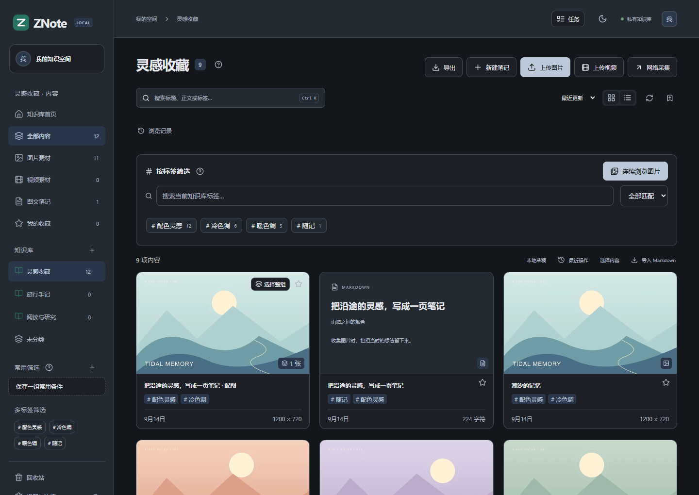 | 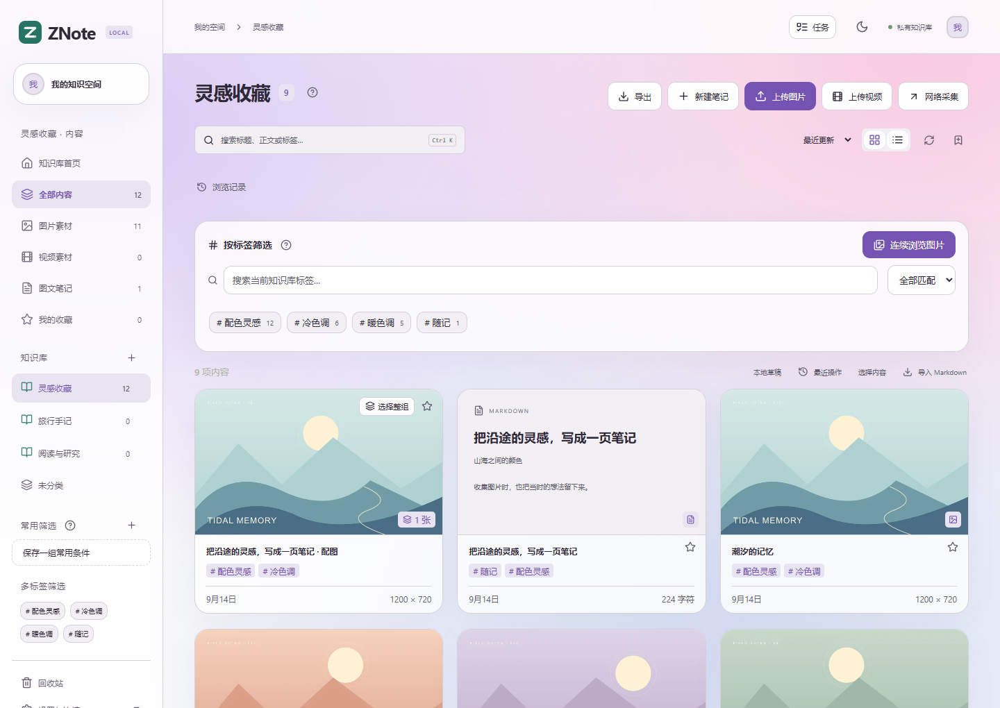 |
| **赛博朋克 · 霓虹色彩** | **纸感 · 温暖阅读** |
| 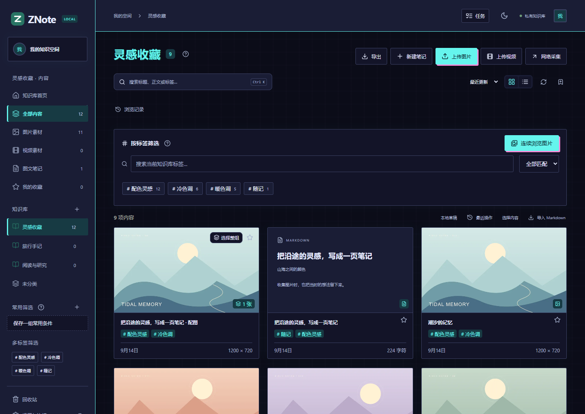 | 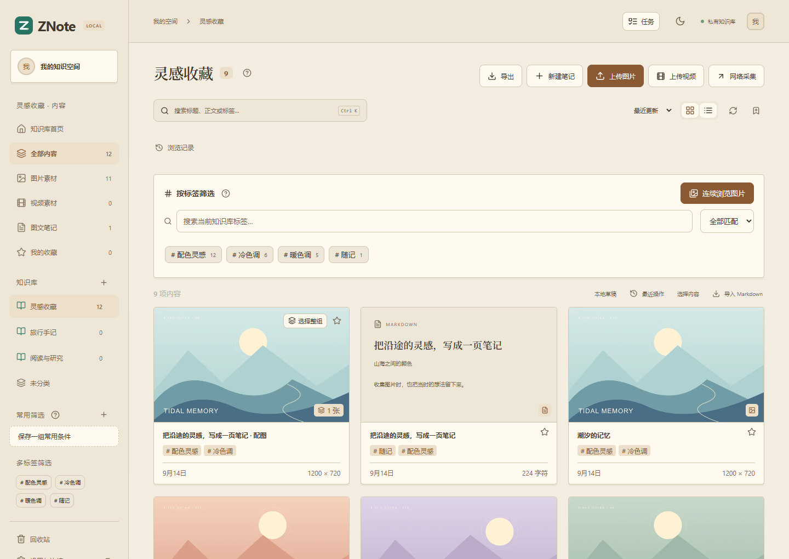 |

<table>
  <tr>
    <td width="38%" align="center">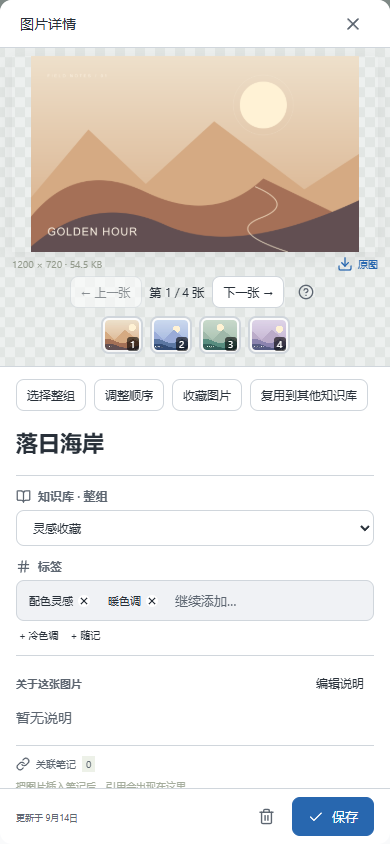</td>
    <td>
      <strong>桌面整理，手机随时回看。</strong><br /><br />
      电脑、手机和平板通过浏览器访问同一个 ZNote。图片浏览位置、视频播放记录与常用筛选可以在同一服务的设备间使用。<br /><br />
      图片组支持滑动翻页，展开后可双指缩放。长笔记在内容区域滚动，操作栏保持可见。<br /><br />
      无需为每台设备复制整个素材目录；可通过 Windows / Mac 客户端、Android 客户端和浏览器访问；iPhone 可添加到主屏幕。当前不提供整库离线同步。
    </td>
  </tr>
</table>

## 客户端下载

**[前往 Releases 下载测试版](https://github.com/BorderArea01/ZNote/releases)** · [安装与迁移指南](docs/CLIENTS.md)

| Windows | macOS | Android | iPhone / iPad |
| --- | --- | --- | --- |
| 64 位 EXE / ZIP | Apple 芯片与 Intel 分别提供 DMG / ZIP | Android 10+ 签名 APK | Safari → 添加到主屏幕 |

电脑端可以连接现有服务，也可使用内置本机服务；手机连接电脑或 NAS 上的同一知识库。首个客户端版本为 Beta，Windows / Mac 尚无商业签名 / Apple 公证；iPhone 主屏幕入口属于 Web 应用，本次没有原生 IPA。具体构建与验证结果以 Release 说明为准。

## 快速开始

需要 **Node.js 24 或更新版本**。

```bash
git clone https://github.com/BorderArea01/ZNote.git
cd ZNote
npm ci
npm run build
npm start
```

打开 **[http://localhost:3741](http://localhost:3741)**，首次在运行服务的本机设置访问密码，即可使用。支持四位数字密码。

| 使用场景 | 连接方式 |
| :--- | :--- |
| 服务器本机 | `http://localhost:3741` |
| 局域网内的手机、平板或其他电脑 | `http://服务器局域网IP:3741`，地址可在设置中查看 |
| 在外通过微信投递 | 手机和 ZNote 主机分别联网即可，见 [微信收件箱](#微信收件箱) |
| 在外直接浏览知识库 | 另行配置远程访问，项目不会自动生成公网地址 |

默认数据目录为 **`data/`**，更新代码时请保留；默认端口 `3741`，可通过 `PORT` 修改。手机上的 `localhost` 指手机自身，访问电脑时请使用电脑的局域网 IP。服务停止后，其他设备无法访问网页或继续收件。

**Windows 长期使用：** 推荐安装 [后台任务](docs/DEPLOYMENT.md#本机运行)，支持登录自动启动、意外退出后重试，避免关闭临时终端后知识库失联。

<details>
<summary>Docker / NAS 部署</summary>

仓库提供 [Dockerfile](Dockerfile) 和 [Compose 配置](compose.yaml)。首次容器初始化，在 `.env` 中设置 `ALLOW_REMOTE_SETUP=true`：

```bash
docker compose up -d --build
```

访问 `http://NAS_IP:3741` 设置密码后，删除该初始化变量，再运行 `docker compose up -d`。数据保存在持久卷中；Docker 配置已提供，尚未完成容器运行验收。完整参数、HTTPS 与升级步骤见 [部署指南](docs/DEPLOYMENT.md)。

</details>

## 原文件可恢复，数据可迁移

**内容属于你，也应该方便带走。** 图片原始字节完整保留，只有 Gzip 更小时才使用无损封装；重复内容共享原文件，缩略图按需生成。视频保留原文件，不进行有损转码。

| 导出方式 | 适合的用途 |
| :--- | :--- |
| 资料包 | 一起带走 Markdown、原文件和元数据 |
| 图片包 | 导出所选范围的原图与说明 |
| Markdown | 在其他笔记工具中阅读，附件改为相对路径 |
| JSON | 脚本处理、数据分析与二次开发 |
| 离线网页 | 解压后浏览图文与可播放视频 |
| 恢复快照 / 迁移备份 | 同盘快照复用媒体；迁移 ZIP 按需生成并直接下载 |

自动恢复快照不会为每个版本重复保存全部媒体；需要换机器时再按需导出迁移 ZIP。右上角「任务」可查看上传、采集、导出与快照状态；两种方式都覆盖数据库和入库原文件，本地浏览器草稿不在其中。

数据库、索引和备份存在额外占用，因此**不承诺素材库总大小一定比直接存文件更小**。[存储结构、容量与恢复步骤 →](docs/STORAGE.md)

## 为你的工作流留出接口

ZNote 提供 **REST API、OpenAPI、读写令牌、增量事件和 Webhook**。浏览器扩展之外，也可以接入自己的脚本、采集工具与自动化流程。

```bash
curl http://localhost:3741/api/items \
  -H "Authorization: Bearer YOUR_API_TOKEN"
```

| 接入方向 | 可使用的能力 |
| :--- | :--- |
| 内容与素材 | 笔记、图片、视频、知识库、标签与批量整理 |
| 采集与处理 | 图片上传、平台视频任务、HLS 合并、来源记录 |
| 事件与插件 | 增量事件轮询、Webhook 签名、失败重试 |

登录后打开 [交互式 API 文档](http://localhost:3741/api-docs)，或读取 `/api/openapi.json`。

[API 指南](docs/API.md) · [外部采集示例](examples/clip.mjs) · [事件轮询](examples/events.mjs) · [Webhook 接收器](examples/webhook-receiver.mjs)

### 可选 AI 工作流插件

仓库内的 [ZNote 对话学习笔记](addons/ai/znote-conversation-notes/skills/znote-conversation-notes/SKILL.md) 可以把 ChatGPT、Claude、Gemini 等 AI 对话提炼为可复习的 Markdown 图文笔记，再通过写入令牌保存到指定知识库。插件会保留关键推理、出处、图片、可复用步骤和复习问题；API 令牌只保存在用户目录或环境变量中，不进入仓库。

```bash
codex plugin marketplace add BorderArea01/ZNote
codex plugin add znote-conversation-notes@znote
```

这是可选插件，不影响 ZNote 服务、网页和客户端的正常使用。

## 文档与开发

[文档总索引](docs/README.md) · [扩展总索引](addons/README.md)

| 文档 | 你会找到什么 |
| :--- | :--- |
| [完整使用指南](docs/USAGE.md) | 多选、分组、视频续播、任务、草稿、版本与采集细节 |
| [部署指南](docs/DEPLOYMENT.md) | 本机、局域网、Docker、配置与更新 |
| [存储与迁移](docs/STORAGE.md) | 去重、无损保存、六种导出与备份恢复 |
| [微信接入](addons/connectors/weixin/README.md) | 扫码、归档、联网条件与迁移 |
| [普通扩展](addons/browser/clipper/README.md) | 安装、连接、批量入库与格式支持 |
| [AI 对话学习笔记插件](addons/ai/znote-conversation-notes/skills/znote-conversation-notes/SKILL.md) | 把 AI 对话归纳成图文学习笔记并安全写入 ZNote |
| [API 接入](docs/API.md) / [开发指南](docs/DEVELOPMENT.md) | 鉴权、示例、结构、测试与贡献 |
| [更新记录](CHANGELOG.md) / [体验优化路线](docs/EXPERIENCE-ROADMAP.md) | 已完成改进与后续方向 |
| [扩展设计与参考](docs/EXTENSION-DESIGN.md) / [第三方组件](THIRD_PARTY_NOTICES.md) | 开源参考、组件来源与许可证 |

主要技术：**React + Vite · Express · SQLite · Sharp · Manifest V3**。正文提取使用 Mozilla Readability / Turndown，HLS 预览使用 HLS.js。

<details>
<summary>本地开发与验证</summary>

后端运行 `npm start`，另一个终端运行 `npm run dev` 启动前端开发服务。

```bash
npm test                 # API、存储、备份与媒体处理测试
npm run build            # 构建网页
npm run clipper:build    # 修改正文提取源码后重新打包扩展脚本
npm run test:ui          # 浏览器界面测试，需要 Microsoft Edge
```

图片直接上传单张上限 100 MB（外链归档和微信接收仍为 25 MB），视频单个上限 500 MB，支持 MP4、WebM、MOV 和 MKV 容器；视频播放能力取决于浏览器编码支持，无法直接播放时仍可下载原文件。批量选择多个视频时可以组成视频组，首个视频作为封面。m3u8 支持完整点播流及普通 AES-128，不提供持续直播录制或 DRM / DASH 合并。已验证 Windows / Edge、本机与局域网访问。

</details>

---

<div align="center">
  <p><strong>随手收集的灵感，值得一个长久的家。</strong></p>
  <p>自有代码采用 <a href="LICENSING.md">GPL-3.0-or-later</a>，第三方组件保留原许可。</p>
  <p><a href="https://github.com/BorderArea01/ZNote/discussions">交流与建议</a> · <a href="CONTRIBUTING.md">参与维护</a> · <a href="https://github.com/BorderArea01/ZNote/issues">反馈问题 / 提出建议</a> · <a href="CHANGELOG.md">查看更新</a> · <a href="#快速开始">开始使用</a></p>
</div>
