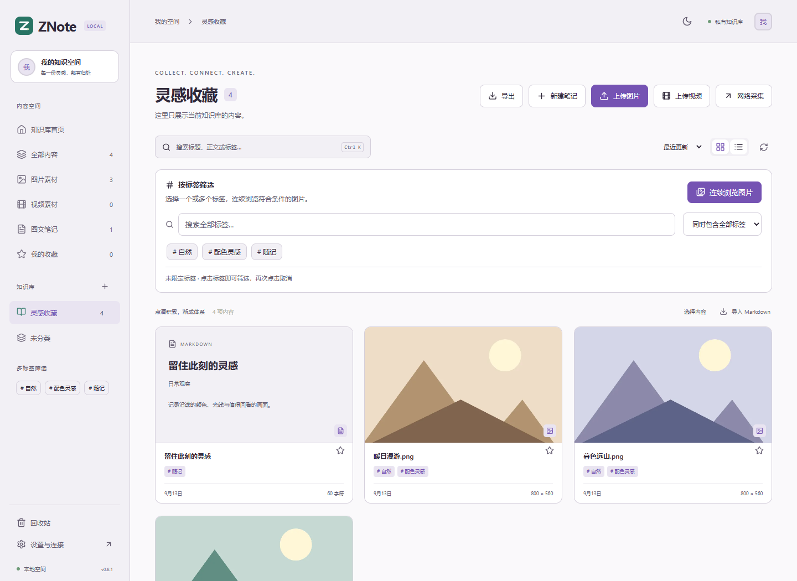
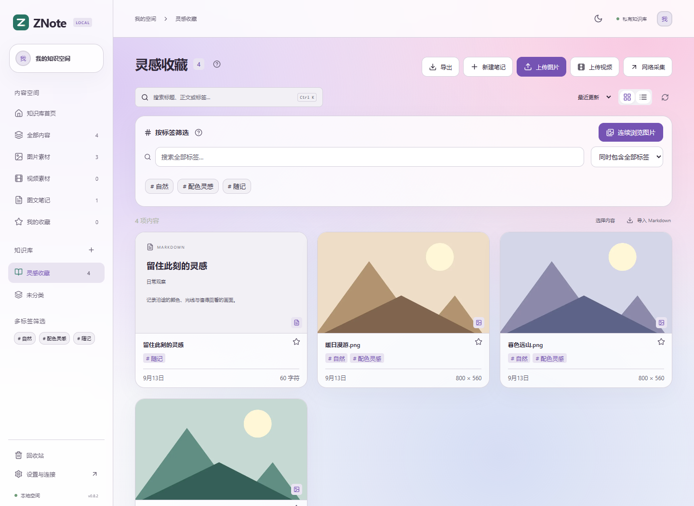
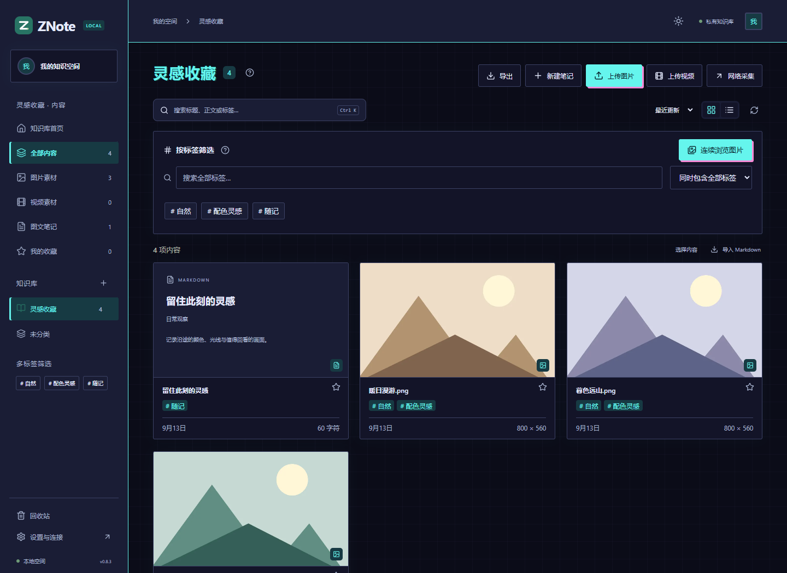
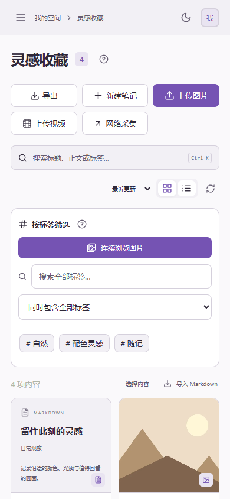

<div align="center">
  
  <h1>ZNote</h1>
  <p><strong>把图片、视频和想法，放进自己的知识库。</strong></p>
  <p>图片素材库 · Markdown 图文笔记 · 浏览器采集 · 局域网自托管</p>
  <p>
    
    
    
    
  </p>
  <p>
    <a href="#快速开始">快速开始</a> ·
    <a href="#浏览器采集">浏览器采集</a> ·
    <a href="docs/API.md">API 接入</a> ·
    <a href="docs/STORAGE.md">备份与迁移</a> ·
    <a href="https://github.com/BorderArea01/ZNote/issues">反馈问题</a>
  </p>
</div>



## 为视觉资料而生

收藏一张参考图，记下一段想法，保存一篇值得重读的文章。ZNote 将这些内容放在同一个空间：**图片可以独立管理，也可以成为笔记的一部分；数据留在你自己的电脑或 NAS 上。**

| 能力 | 你可以做什么 |
| :--- | :--- |
| 🖼️ 图片素材库 | 批量上传、拖拽和粘贴；添加标题、说明、多标签与收藏；按筛选结果连续翻图 |
| ✍️ 图文笔记 | 编辑和预览 Markdown，插入图片，保留文字链接、表格与代码，使用 `[[双向链接]]` |
| 🎬 视频收藏 | 保存 MP4、WebM、MOV，在浏览器预览、拖动进度、全屏播放 |
| 🧩 浏览器采集 | 悬停看大图，点按钮或按快捷键下载/入库；浮窗发现图片、视频和 m3u8；提取网页正文 |
| 🏷️ 有序归类 | 所有分类、标签与回收站按知识库隔离；多标签筛选、批量删除与恢复 |
| 🔌 开放接口 | REST API、OpenAPI、读写令牌、增量事件与 Webhook，方便工具和插件接入 |
| 📦 数据可带走 | 六种导出、自动备份、网页恢复；原文件按字节保留，同内容去重 |
| 🌐 随处访问 | 一个服务，电脑、手机和平板通过浏览器访问；适合家庭或个人局域网 |

## 成组浏览与整理

同一篇笔记的配图会在素材库折叠成组；点击正文中的任意图片，按正文顺序连续浏览。预览下方有可点击的缩略图列，也可用 **A / D、← / →** 或在图片上滚动鼠标翻页。**点击图片展开后，滚轮改为缩放**，拖动平移，双击复位。

在图片组预览中修改 **「知识库 · 整组」** 并保存，会移动整组图片；笔记配图组会连同笔记一起移动。目标存在冲突时整次取消。需要单页整理时，使用「选择内容」。配图记录独立管理，相同原图共享文件，不重复占用原图空间。

图片说明支持 Markdown，作者和来源保留可点击链接，原图地址与重复来源不再堆在说明中。筛选、上传和编辑时的标签建议均来自所选知识库。

## 外观与主题

简约、毛玻璃、赛博朋克、纸感四种风格，支持浅色、夜间和跟随系统。简约与毛玻璃可选松林绿、海湾蓝、鸢尾紫、玫瑰粉、琥珀橙、石墨灰六种色调。

操作说明收进问号提示：鼠标悬停、键盘聚焦或手机点击时查看，平时把空间留给内容。

| 毛玻璃 · 柔和通透 | 赛博朋克 · 夜间霓虹 |
| :---: | :---: |
|  |  |

<details>
<summary>查看手机布局</summary>
<br />

</details>

<sub>截图来自真实界面，展示的是测试生成的示例素材。</sub>

## 快速开始

需要 **Node.js 24 或更新版本**。

```bash
git clone https://github.com/BorderArea01/ZNote.git
cd ZNote
npm ci
npm run build
npm start
```

打开 **[http://localhost:3741](http://localhost:3741)**，首次设置访问密码，即可使用。支持四位数字密码。

- **局域网访问**：在其他设备打开 `http://服务器局域网IP:3741`，地址可在「设置与连接」中查看。
- **数据位置**：默认保存到项目下的 `data/`，更新代码时保留这个目录。
- **端口**：默认 `3741`，可通过 `PORT` 环境变量修改。
- **开发模式**：后端运行 `npm start`，另一个终端运行 `npm run dev`。

### Docker / NAS

仓库提供 [Dockerfile](Dockerfile) 和 [Compose 配置](compose.yaml)。首次容器初始化，在 `.env` 中设置 `ALLOW_REMOTE_SETUP=true`，然后执行：

```bash
docker compose up -d --build
```

访问 `http://NAS_IP:3741` 设置密码后，删除该初始化变量，再运行 `docker compose up -d`。数据保存在持久卷中。完整参数、HTTPS 与升级步骤见 **[部署指南](docs/DEPLOYMENT.md)**。

## 浏览器采集

扩展使用独立的石墨灰暗色界面与蓝紫色强调色，覆盖悬停预览、资源浮窗、作品批量入库和连接设置。网页知识库仍可使用你选择的主题。


桌面 **Chrome / Edge** 扩展随项目提供。

### 连接一次，之后直接使用

1. 在 ZNote「设置与连接」下载扩展 ZIP，解压到固定目录。
2. 打开浏览器扩展管理页，启用开发者模式，选择「加载解压缩的扩展」。
3. 在同一个浏览器刷新 ZNote，点击 **「一键连接扩展」**，无需复制地址或 API 令牌。
4. 在扩展设置里选择默认知识库、标签和快捷键。

**网站黑名单**位于扩展设置的「浏览器行为」中：每行一个域名（含子域名）或完整网站地址（区分端口）。命中后停用悬停预览、媒体浮窗和图片 / 视频嗅探；当前连接的知识库及带有 ZNote 页面标记的网站自动排除。保存后已打开页面同步生效。

**正常更新会保留连接与偏好**：覆盖原目录并重新加载扩展，再刷新目标网页即可。0.7 及更早版本首次升级，需要移除旧版、加载新版，再一键连接一次。

### 图片、视频、正文，一起收藏

| 采集对象 | 操作 |
| :--- | :--- |
| 图片 | 悬停展开大图，直接点击下方 **下载 / 保存知识库**；也可使用默认 `S` / `Z` 快捷键 |
| 预览大小 | 使用大图下方滑杆调节；窗口自动避开正在操作的封面，兼容视频封面悬停播放 |
| 视频资源 | 打开常驻「媒体」浮窗，发现并筛选图片、MP4 和 m3u8，选择预览、下载或入库 |
| 网页正文 | 点击「保存页面正文」，提取为可编辑 Markdown，默认将配图一并归档 |
| 网页截图 | 使用扩展弹窗或右键菜单截图当前可见页面 |

网络采集自动保留**来源网址和网站标签**，例如「小红书」「b站」「抖音」「X」。同一文件从多个页面采集，会合并来源，方便回看出处。

**Pixiv / Pawchive**：在单个作品页采集正文。Pixiv 读取全部页的原图和作品说明；Pawchive 从正文文件链接获取原图，排除头像、推荐卡片和缩略图。

**漫画与多图作品**：在 Pixiv 作者 / 推荐页、Pawchive 列表的小封面上，也能展开对应作品并滚轮翻页。预览优先使用网站提供的较轻大图，提前加载相邻页；「查看原图」可切换完整画质。鼠标留在原缩略图或展开预览上都能翻页。点击「批量下载 N 张」按页序保存到 `下载目录/ZNote/作品标题/001.png…`，点击「批量入库 N 张」可选择知识库与多个标签，整组原图带上来源链接、网站标签和页码。下载和入库分别记录进度，始终使用原文件，支持停止、继续、失败重试和刷新恢复。其他网站按当前文章或明确图库中可识别的图片分组，每组最多 200 张。

**Pixiv 增强版**：需要作者、收藏、搜索、排行榜等完整抓取与筛选时，可在设置页下载基于 Powerful Pixiv Downloader 的独立增强版。保留原插件功能；作品封面旁点击「入库」或按 **Z**，就地选择「按作品分组」或「逐张入库」（快捷键沿用上次选择）。自动加入作者姓名标签，并沿用原插件下载后自动收藏、附带标签及公开 / 私密设置。作者、收藏等目录点击「当前范围入库」，沿用原插件的整目录范围与筛选，一次排队数百部作品。知识库选择、标签、进度、停止和重试都在 Pixiv 页内操作，无需跳转。后台归档原图、漫画、APNG 动图与 Markdown 小说，并保留作者、来源和标签；已排队任务离开页面仍继续，浏览器重启后恢复。首次连接填写一次写入令牌；增强版更新后保留连接。安装与动图 / 小说边界见 [增强版说明](integrations/pixiv/README.md)，完整对应源码也可从设置页下载。

**图文笔记的配图默认本地归档**：普通 Markdown 外链图片也会在保存时尝试入库，成功后改为内部地址。已有笔记可点击「归档外部配图」；无法下载时保留来源和失败说明。每次最多 200 张 / 500 MB，单张 25 MB，可再次保存继续处理。

**批量删除**：按标签筛选 →「选择内容」→ 勾选当前页或指定图片 →「删除所选」。内容进入当前知识库回收站，支持批量恢复。

更多操作、权限和格式支持见 **[扩展使用说明](extensions/clipper/README.md)**。m3u8 合并及平台视频链接解析需要媒体组件，可运行 `npm run media:setup` 安装。

离开原图和预览区域后约 150 毫秒收起；移向按钮时保留穿过间隙的时间。旧版默认 S/K 会改为 S/Z，其他自定义组合保留；需要 K 时可在新版设置中重新指定。

## 原文件可恢复，数据可迁移

图片原始字节完整保留：只有 Gzip 更小时才使用无损封装；重复内容共享存储，缩略图按需生成。视频保留原文件，不进行有损转码。

| 导出方式 | 适合的用途 |
| :--- | :--- |
| 资料包 | 一起带走 Markdown、原文件和元数据 |
| 图片包 | 导出所选范围的原图与说明 |
| Markdown | 在其他笔记工具中阅读，附件改为相对路径 |
| JSON | 脚本处理、数据分析、二次开发 |
| 离线网页 | 解压后直接浏览图文与可播放视频 |
| 完整备份 | 恢复整个实例，包含所有知识库及回收站 |

数据库、备份会有额外占用，因此**不承诺每个素材库的总大小都小于直接存文件**。具体存储结构、容量统计和恢复步骤见 [存储与迁移](docs/STORAGE.md)。

## 为你的工作流留出接口

登录后打开 **[交互式 API 文档](http://localhost:3741/api-docs)**，或读取 `/api/openapi.json`。

```bash
curl http://localhost:3741/api/items \
  -H "Authorization: Bearer YOUR_API_TOKEN"
```

- **内容与素材**：笔记、图片、视频、知识库、标签及批量整理。
- **采集与集成**：图片上传、平台视频任务、HLS 合并、来源记录。
- **事件与插件**：增量事件轮询、Webhook 签名和失败重试。

[API 指南](docs/API.md) · [外部采集示例](examples/clip.mjs) · [事件轮询](examples/events.mjs) · [Webhook 接收器](examples/webhook-receiver.mjs)

## 开发与维护

```bash
npm test                 # API、存储、备份与媒体处理测试
npm run build            # 构建网页
npm run clipper:build    # 修改正文提取源码后重新打包扩展脚本
npm run test:ui          # 浏览器界面测试，需要 Microsoft Edge
```

项目主要由 **React + Vite、Express、SQLite、Sharp** 构成。扩展使用 Manifest V3，正文提取使用 Mozilla Readability / Turndown，HLS 预览使用 HLS.js。

| 文档 | 内容 |
| :--- | :--- |
| [部署指南](docs/DEPLOYMENT.md) | 本机、局域网、Docker、配置与更新 |
| [存储与迁移](docs/STORAGE.md) | 去重、无损保存、六种导出、备份恢复 |
| [API 接入](docs/API.md) | 鉴权、常用接口、Webhook 与示例 |
| [开发指南](docs/DEVELOPMENT.md) | 目录结构、构建、测试、贡献方式 |
| [更新记录](CHANGELOG.md) | 版本变化 |
| [扩展设计与参考](docs/EXTENSION-DESIGN.md) | 开源参考、界面约定与回归入口 |
| [第三方组件](THIRD_PARTY_NOTICES.md) | 主要依赖、来源与许可证 |

### 当前边界

- 面向自托管浏览器访问；尚无原生客户端或离线同步。
- 图片单张 25 MB，视频单个 500 MB；视频播放能力取决于浏览器支持的编码。
- m3u8 支持完整点播流及普通 AES-128，不提供持续直播录制或 DRM/DASH 合并。
- 网页提取处理当前已加载正文；登录状态、防盗链和站点变化可能影响采集，不保证所有平台链接可用。
- 已验证 Windows / Edge、本机与局域网地址访问；Docker 配置已提供，尚未完成容器运行验收。

---

<div align="center">
  <strong>收集灵感，让每一份资料都有去处。</strong><br />
  <a href="https://github.com/BorderArea01/ZNote/issues">报告问题 / 提出建议</a>
</div>
